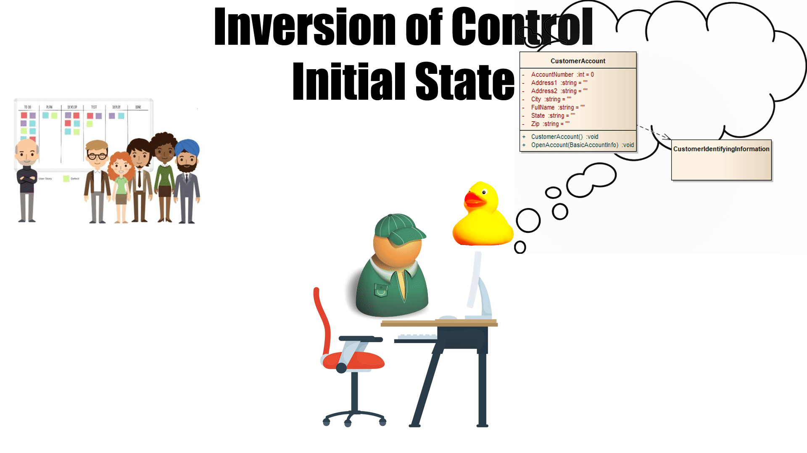

## Welcome to the first Nerd Ninja Architecture Contest!

### Instructions

1. Pick a well-known Technology/Software/Infrastructure Pattern
2. Explain it in a silly/stupid/absurd way
3. Make some kind of graphic or video to tell your joke
4. Submit a pull request to this repository
5. Publish/like/recommend/share a link somewhere online so that we know you're not trying to keep the contest a secret
6. Have Greg pick you as the winner
7. Enjoy a cool slice of  Raspberry Pi!

### Here's a sample.

